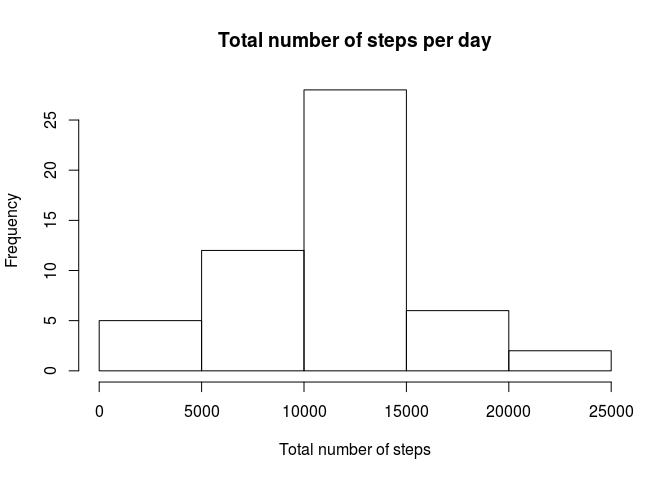
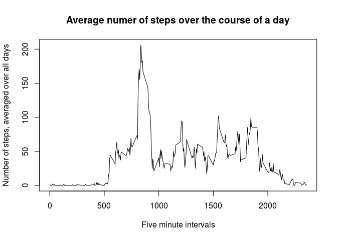
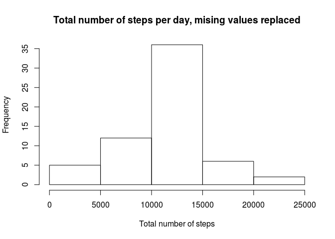
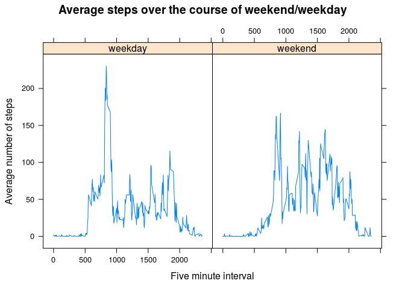

# Reproducible Research: Peer Assessment 1


## Loading and preprocessing the data
We start by setting our working directory and loading in the activity
dataset using read.csv(). We will use the data.table package so that
we can summarize the data easier later on.

```r
setwd('~/Coursera/DS Repo/RepResearch/RepData_PeerAssessment1')
library(data.table)
actData <- data.table(read.csv('activity.csv'))
```
We now create a new column posDate in our data table that converts
the 'date' column from a string to a POSIXct object. This will be 
necessary when working with dates in our analysis

```r
actData$posDate <- as.POSIXct(actData$date, format='%Y-%m-%d')
```
## What is mean total number of steps taken per day?
First we create a new data set that is the sum of the total number
of steps taken in each day. Here is where using data tables makes
life easier. 

```r
daySum <- actData[, list(sum=sum(steps)),by=posDate]
```
Now we create a histogram to get a sense of the distribution of the total
steps for each day.

```r
hist(daySum$sum, xlab='Total number of steps', main='Total number of steps per day')
```



The mean and median of the total number of steps per day are:

```r
list(mean=mean(daySum$sum, na.rm=TRUE), median=median(daySum$sum, na.rm=TRUE))
```

```
## $mean
## [1] 10766.19
## 
## $median
## [1] 10765
```

## What is the average daily activity pattern?
First we create a new data set that contains the average number of steps
grouped by each five minute interval. Then we plot these values.

```r
intAvg <- actData[,list(mean=mean(steps, na.rm=TRUE)),by=interval]
plot(intAvg$interval, intAvg$mean, type='l',xlab='Five minute intervals',
     ylab='Number of steps, averaged over all days',
      main='Average numer of steps over the course of a day')
```



From the plot we can see a clear spike in the first half of the day. The
exact value and location of this spike is:

```r
intAvg[mean==max(intAvg$mean),]
```

```
##    interval     mean
## 1:      835 206.1698
```

## Imputing missing values
The number of missing values, which are given as NA in the dataset, is:

```r
sum(is.na(actData$steps))
```

```
## [1] 2304
```
We will replace the NA values with the average value for that five minute interval.
Start by creating a new data table, impData, then we will loop through each value 
of steps. At each point we check if it is NA, and if it is we replace it. To get
the correct value we take the interval value from the impData and match it to
the interval value in the averages we calculated above.

```r
impData <- actData
for(i in seq_along(impData$steps)) {
      if(is.na(impData$steps[i])) {
            impData$steps[i] <- intAvg$mean[intAvg$interval == impData$interval[i]] }
}
```
Now we will create a data set that contains the total steps over each day for
the new imputed data, and create a histogram of these values.

```r
impSum <- impData[, list(sum=sum(steps)),by=posDate]
hist(impSum$sum, xlab='Total number of steps',main='Total number of steps per day, mising values replaced')
```


The histogram is very similar to the first one we created, but with a larger
peak around the middle. We replaced the NA values with average values,
so it is expected that there are more values at the mean.

Now we calculate the mean and median of the imputed data set:

```r
list(mean=mean(impSum$sum, na.rm=TRUE), median=median(impSum$sum, na.rm=TRUE))
```

```
## $mean
## [1] 10766.19
## 
## $median
## [1] 10766.19
```
First note that the mean is the same as before. The values we added to the data
were all average values, so this is to be expected. 

Next note that the median has increased slightly and is now equal to the mean. 
Adding values equal to the mean should pull the median towards the mean, so this
is also to be expected. 

## Are there differences in activity patterns between weekdays and weekends?
First create a new factor variable dayType with levels 'weekday' and 'weekend' from
our posDate variable. We use the weekdays() function to get the name of the day
from our POSIXct variable. Then we check if this is 'Saturday' or 'Sunday', resulting
in FALSE, or 0, for weekdays and TRUE, or 1, for weekends. Thus having the labels in
the order of 'weekday', 'weekend' results in the correct labeling of these factors.

```r
impData$dayType <- factor(weekdays(impData$posDate)%in%c('Saturday','Sunday'), labels=c('weekday','weekend'))
```
Now that we have created our new factor variable, we want to calculate the average steps per 
interval as we did earlier. This time we also group first by interval, then by our
new factor variable dayType.

```r
impInt <- impData[,list(mean=mean(steps)),by=c('interval','dayType')]
```
Now that we have our data organized we will use the lattice plot system
to create a panel plot of average steps vs. interval, splitting them
up by the dayType factor.

```r
library(lattice)
xyplot(mean~interval|dayType, data=impInt, type='l', xlab='Five minute interval',
       ylab='Average number of steps', main='Average steps over the course of weekend/weekday')
```



From the plot we can see that there is clearly different behavior on
weekends and weekdays. Weekdays are characterized by a large spike in activity
around 500 minutes, likely where people are starting to go to work.
This is followed by a lower level of activity. On weekends the actvity level
ramps up slowly starting around 500 minutes and does not experience such a 
drastic peak. The activity level in the middle of the day seems to be slightly
higher than on weekdays.
